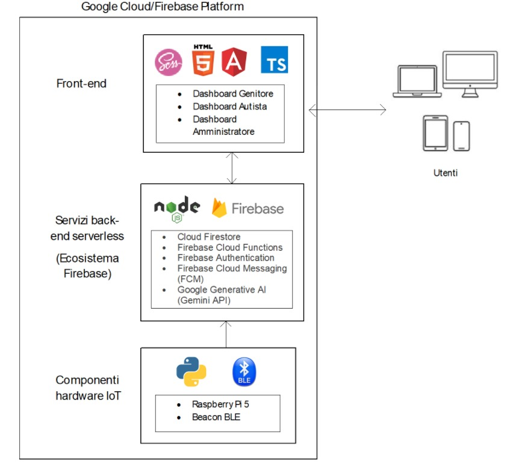

# IotScuolabus

This project was generated using [Angular CLI](https://github.com/angular/angular-cli) version 20.0.1.

## Development server

To start a local development server, run:

```bash
ng serve
```

Once the server is running, open your browser and navigate to `http://localhost:4200/`. The application will automatically reload whenever you modify any of the source files.

## Code scaffolding

Angular CLI includes powerful code scaffolding tools. To generate a new component, run:

```bash
ng generate component component-name
```

For a complete list of available schematics (such as `components`, `directives`, or `pipes`), run:

```bash
ng generate --help
```

## Building

To build the project run:

```bash
ng build
```

This will compile your project and store the build artifacts in the `dist/` directory. By default, the production build optimizes your application for performance and speed.

## Running unit tests

To execute unit tests with the [Karma](https://karma-runner.github.io) test runner, use the following command:

```bash
ng test
```

## Running end-to-end tests

For end-to-end (e2e) testing, run:

```bash
ng e2e
```

Angular CLI does not come with an end-to-end testing framework by default. You can choose one that suits your needs.

## Additional Resources

For more information on using the Angular CLI, including detailed command references, visit the [Angular CLI Overview and Command Reference](https://angular.dev/tools/cli) page.

## Introduzione

Il progetto B.U.S. è una piattaforma intelligente pensata per migliorare la sicurezza e la trasparenza del servizio di trasporto scolastico. Grazie a un sistema automatizzato di rilevamento basato su beacon BLE, i genitori possono monitorare in tempo reale la presenza dei bambini a bordo dello scuolabus. Questo repository contiene l’interfaccia Web sviluppata in Angular, che offre un'interfaccia semplice e intuitiva per la consultazione delle informazioni, la gestione degli utenti e l’interazione con il sistema.

## Architettura del sistema

La Web App comunica con Firestore per leggere/scrivere i dati in tempo reale, riceve notifiche push tramite Firebase Cloud Messaging e interagisce con le funzioni serverless per la logica dinamica. I dati arrivano dal Raspberry Pi che rileva i beacon BLE assegnati ai bambini.



## Funzionalità utente

Genitore:
-	Registrazione e login (via email/password o Google).
-	Associazione figli e visualizzazione attività.
-	Ricezione notifiche push.
-	Accesso alla cronologia spostamenti.
-	Utilizzo chatbot per richieste personalizzate.

Autista:
-	Visualizzazione elenco bambini.
-	Possibilità di modificare manualmente lo stato di salita/discesa.

Amministratore:
-	Gestione entità come: autisti, beacon, fermate, genitori, bambini.
